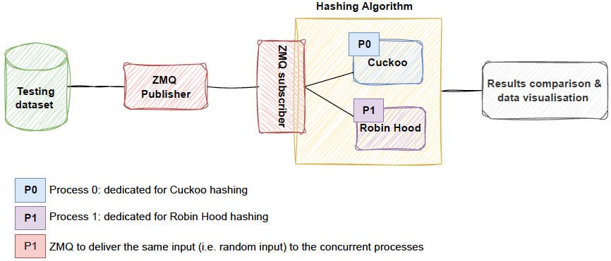

# A Study of Evaluating Cuckoo Hashing vs. Robin Hood Hashing

In this project we present two hashing techniques, namely Cuckoo Hashing and Robin Hood Hashing, it focus more on implementing Cuckoo Hashing and evaluating its performance with Robin Hood Hashing. A pipeline that descries the whole process is shown in the figure below: 

## Prerequisites

- C++17 (The project is developed using this version, but it should be compatible with other C++ versions. Ensure library compatibility according to your C++17)
- C++ libzmq https://github.com/zeromq/zmqpp

## Working environment: 
HW: A node consists of two **Intel Xeon Gold 5220R** processors, each with **24 cores** (48 threading cores) and a base frequency of **2.2GHz**. The system is equipped with **96 GB of RAM** and two **240GB SSDs** local disks. However, for storage, instead of using the local disks, we relied on a GPFS (General Parallel File System) mounted on the server. The GPFS provided a storage capacity of 0.5 Peta Byte (PB), with a bandwidth of **100 Gbps** and a read/write performance of **5 GB** per second. The computing node runs Red Hat Enterprise Linux (RHEL) release 8.9. 
